# Действия персонажа и их параметры

## Walk

[//]: # (![PlayerColliderExample]&#40;Assets/ForGithub/640_360_25frames/1_Walk.gif&#41;)
[//]: # (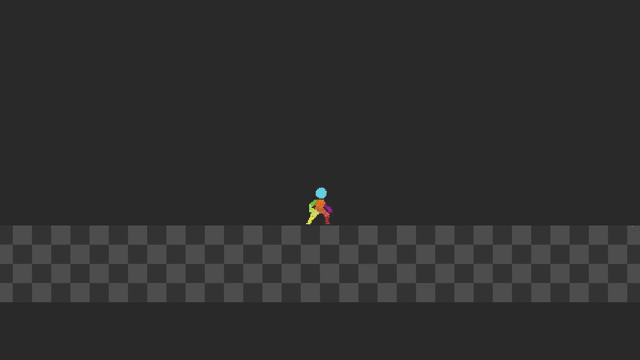)

### Walk Parameters

| Parameter name      	| Description                                           	|
|---------------------	|-------------------------------------------------------	|
| WalkSpeed           	| Character speed while walking                         	|
| WalkAcceleration    	| Acceleration of the character while walking           	|
| WalkDeceleration    	| Slowing down the character while walking              	|
| WalkAirAcceleration 	| Acceleration of the character in the air from walking 	|
| WalkAirDeceleration 	| Slowing down a character in the air from walking      	|

## Run

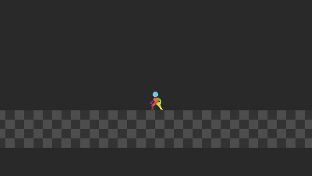

### Run Parameters

| Parameter name        | Description                                           |
|-----------------------|-------------------------------------------------------|
| RunSpeed              | Character speed while running                         |
| RunAcceleration       | Acceleration of the character while running           |
| RunDeceleration       | Slowing down the character while running              |
| RunAirAcceleration    | Acceleration of the character in the air from running |
| RunAirDeceleration    | Slowing down a character in the air from running      |

## Jump 

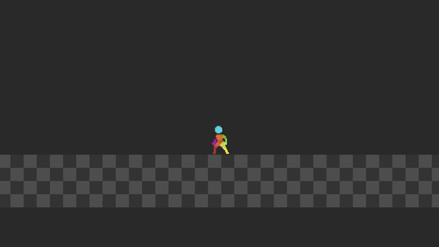

### Jump Parameters

| Parameter name                | Description                                    |
|-------------------------------|------------------------------------------------|
| MaxJumpHeight                 | Maximum jump height                            |
| MinJumpHeight                 | Minimum jump height                            |
| TimeTillJumpApex              | Time to jump peak                              |
| JumpHeightCompensationFactor  | Jump height compensation factor                |
| JumpGravityMultiplayer        | Gravity during jump (upward flight)           |
| FallGravityMultiplayer        | Gravity during fall (downward flight)         |

## Variable Jump 

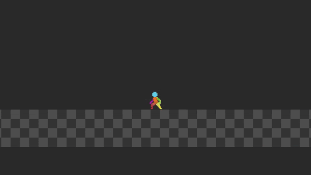

## Multi Jump

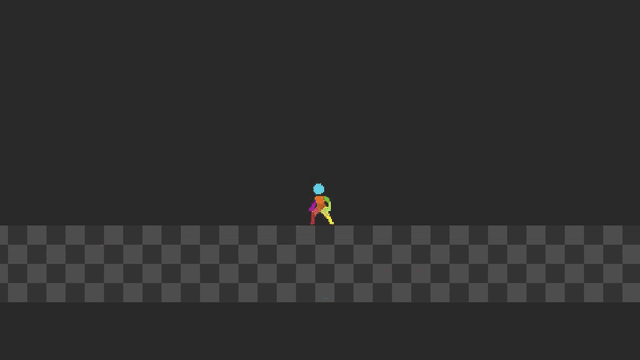

### MultiJump Parameters

| Parameter name    | Description                    |
|-------------------|--------------------------------|
| MaxNumberJumps    | Maximum number of jumps        |

## Buffer Jump

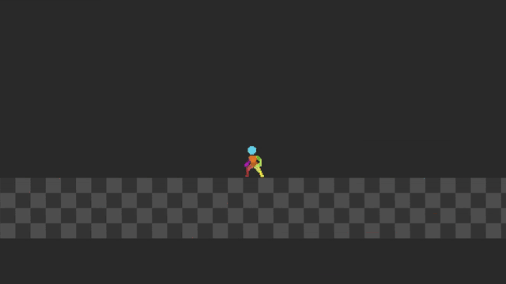

### Buffer Jump Parameters

| Parameter name    | Description                                              |
|-------------------|----------------------------------------------------------|
| BufferTime        | Timer for buffer jump (works for WallJump)              |

## Coyote Jump

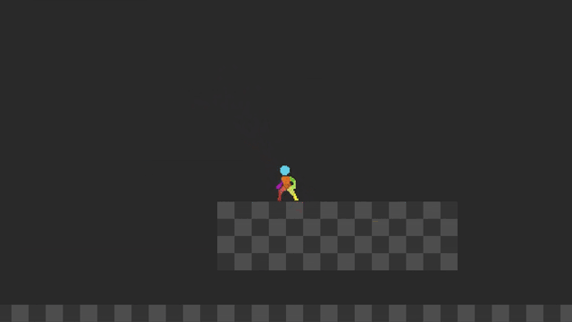

### Coyote Jump Parameters

| Parameter name    | Description                    |
|-------------------|--------------------------------|
| CoyoteTime        | Timer for coyote jump          |

## Dash

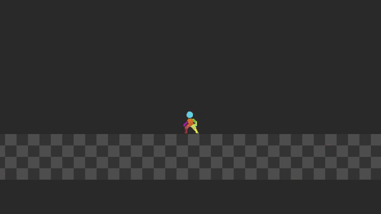

### Dash Parameters

| Parameter name              | Description                                    |
|-----------------------------|------------------------------------------------|
| DashVelocity                | Dash force                                     |
| MaxNumberDash               | Maximum number of dashes                       |
| DashTime                    | Timer for dash                                 |
| DashFallSpeed               | Speed during fall after dash                  |
| DashFallAirAcceleration     | Air acceleration after dash                   |
| DashFallAirDeceleration     | Air deceleration after dash                   |

## Crouch

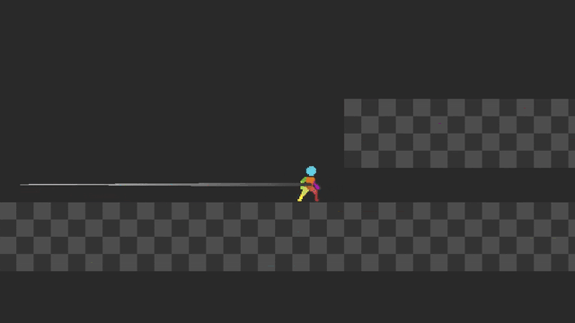

### Crouch Parameters

| Parameter name         | Description                                    |
|------------------------|------------------------------------------------|
| CrouchMoveSpeed        | Movement speed while crouching                 |
| CrouchAcceleration     | Character acceleration while crouching         |
| CrouchDeceleration     | Character deceleration while crouching         |

## Crouch Roll

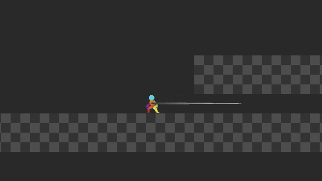

### Crouch Roll Parameters

| Parameter name         | Description                    |
|------------------------|--------------------------------|
| CrouchRollVelocity     | Crouch roll force              |
| CrouchRollTime         | Timer for crouch roll          |

## Wall Slide

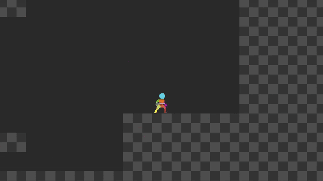

### Wall Slide Parameters

| Parameter name            | Description                                                          |
|---------------------------|----------------------------------------------------------------------|
| StartVelocityWallSlide    | Initial sliding velocity                                             |
| WallSlideSpeedMax         | Maximum allowed sliding speed                                        |
| WallSlideDeceleration     | Deceleration while sliding                                           |
| WallFallTime              | Time to detach from wall sideways (detach, not jump)               |

## Wall Jump

### Wall Jump Parameters

| Parameter name              | Description                                                |
|-----------------------------|-------------------------------------------------------------|
| WallJumpClimb (X, Y)        | Jump towards the wall                                      |
| WallJumpOff (X, Y)          | Jump off the wall (simple jump button on wall)           |
| WallLeap (X, Y)             | Jump to the opposite side of the wall                     |
| WallJumpTime                | Time for input command after pressing jump button on wall |
| WallFallSpeed               | Speed during fall after wall jump                         |
| WallFallAirAcceleration     | Acceleration during fall after wall jump                  |
| WallFallAirDeceleration     | Deceleration during fall after wall jump                  |

