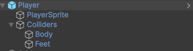

<h1 align="center">Flexible 2D Platformer Controller - Unity</h1>


<p align="center">
    
</p>


<p align="center">
  <!-- GitHub profile -->
  <a href="https://github.com/Vladislav-EG"
     style="text-decoration: none;"></a>
  &nbsp;
  <!-- Unity version -->
  <a href="https://unity3d.com/"
     style="text-decoration: none;"></a>
  &nbsp;
  <!-- Itch.io profile -->
  <a href="https://itch.io/profile/ilovevladislav"style="text-decoration: none;"></a>
</p>


# About

Данный проект является удобным, настраиваемым контроллером для вашей 2D платформерной игры. 
Была реализованна легко модифицируещаеся система для передвижения вашего героя. 
Вы можете использовать ее как отдельную систему, дополняя другими необходимыми системами для игры. 

> [!TIP]
> Вы можете попробовать контроллер в браузере на сайте [Itch.io](https://ilovevladislav.itch.io/platformer-controller-2d)

# Installation
> [!IMPORTANT]<br/>
> Контроллер создавался на Unity версии `6000.0.38f1 / 11 feb 2025`.

Вы можете скачать сам и установить его в Unity, либо пользоваться контроллером как UPM пакетом для Unity

## Установка как проект для Unity

1. Скачать архив с проектом Unity на свой компьютер с помощью `Download .zip` или `git clone`

```console
git clone https://github.com/Vladislav-EG/Platformer2D.git
```

2. Открыть проект с помощью Unity Hub

## Install as a package

Есть два варианта установки пакет, через URL или с диска

> [!IMPORTANT]<br/>
> При установке с диска вы сможете редактировать файлы, установка через URL не дает такой возможности`.

> [!TIP]
> Тестовые сцены можно установить в `Package manager` **-** _`PlatformerController2D` **–** `Samples` **–** `Import`

### Установка с диска

1. Скачать архив с проектом Unity на свой компьютер с помощью `Download .zip` или `git clone`

```console
git clone https://github.com/Vladislav-EG/Platformer2D.git
```

2. В Unity `Windows` – `Package manager` - `+` - `install package from disk` – `pathForDownloadProject\Assets\PlatformerController2D\package.json`


### Установка через URL

> [!IMPORTANT]<br/>
> Нужно скачивать не по классической ссылке которую можно скопировать в Git, а по ссылке с путем до package.json.

1. In Unity – `Windows` – `Package manager` - `+` - `install package from git URL...`

```console
git clone https://github.com/Vladislav-EG/Platformer2D.git?path=/Assets/PlatformerController2D
```

# Usage

При скачивании проекта в папке Scene вы можете запустить любую сцену и попробовать контроллер. 

> [!TIP]
> В `иерархии сцены` или в папке `prefabs` можно найти персонажа и посмотреть его организацию.

## Создание и настройка собственного персонажа

1. Создайте следующую иерархию объектов c их компонентами в Unity

- Player - (Rigidbody2D, PlayerController, CollisionChecker, Physic Handler 2D, Collider Sprite Resizer, InputReader)
  - PlayerSprite (Sprite Renderer)
  - Colliders (CreateEmpty)
    - Body (Capsule Collider 2D \ Box Collider 2D)
    - Feet (Box Collider 2D)

Пример иерархии объектов:  

[//]: # (![ObjectHierarchy]&#40;Assets/ForGithub/ObjectHierarchy.png&#41;)



2. Создайте пресет настроек для персонажа

В Unity `ProjectWindow` - `нажмите правой кнопкой мыши` - `Create` - `PlayerControllerStats`,  
Настройте созданный скриптовый объект по вашему желанию.

> [!IMPORTANT]<br/>
>Снизу есть настройка GroundLayer, создайте слой земли и добавьте его туда, всем блокам земли тоже добавьте этот слой.

Пример части настроек для персонажа объекта Player:  

[//]: # (![BasePreset]&#40;Assets/ForGithub/BasePreset.PNG&#41;)


3. Настройте все компоненты используя примеры ниже 

Пример компонентов объекта Player:  

[//]: # (![PlayerComponents]&#40;Assets/ForGithub/PlayerComponents.PNG&#41;)


Пример физического материала объекта Player:  

[//]: # (![PhysicalMaterial]&#40;Assets/ForGithub/PhysicalMaterial.PNG&#41;)


Пример коллайдеров Player:  

[//]: # (![PlayerColliderExample]&#40;Assets/ForGithub/PlayerColliderExample.PNG&#41;)


## Создание уровня 

Для создания уровня перетащите из папки `Prefabs` на сцену `GridForScene`, выберите этот объект и в окне `Scene` нажмите `Open Tile Palette`,
выделите нужно палитру и создавайте уровень в окне `Scene`.

[//]: # (![PlayerColliderExample]&#40;Assets/ForGithub/Grid.PNG&#41;)


## Configuration 

Go to [about page](POSSIBILITIES.md)


